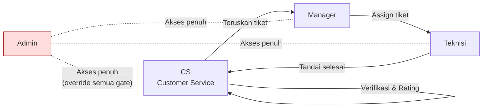
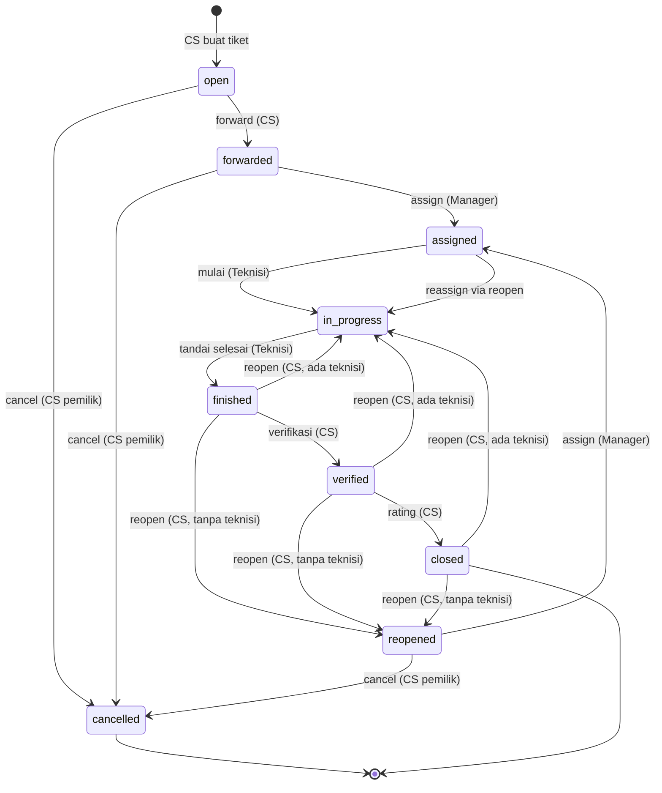
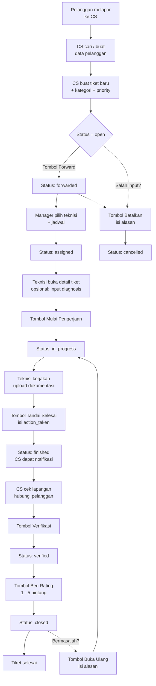
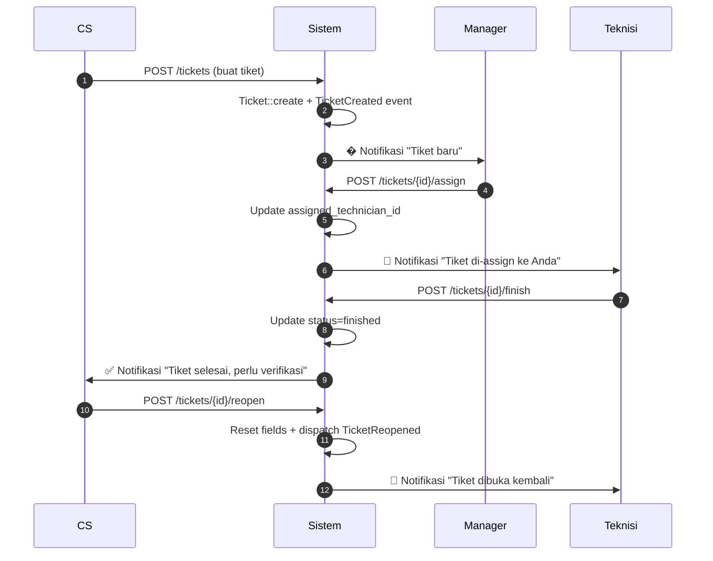

# Panduan Pengguna — Sistem Ticketing

> **Versi:** 1.0  
> **Tanggal:** Agustus 2026  
> **Aplikasi:** Ticketing (Laravel 11)  
> **Pembaca:** End-user — CS, Teknisi, Manager, dan Admin

Dokumen ini adalah panduan resmi untuk menggunakan **Sistem Ticketing** berbasis web. Panduan mencakup alur tiket dari penerimaan keluhan hingga penutupan, lengkap dengan hak akses tiap peran, contoh langkah-langkah di antarmuka, dan daftar pertanyaan umum (FAQ).

---

## Daftar Isi

1. [Pendahuluan](#1-pendahuluan)
2. [Memulai](#2-memulai)
3. [Hak Akses Per Peran](#3-hak-akses-per-peran)
4. [Alur Tiket](#4-alur-tiket)
5. [Panduan Per Peran](#5-panduan-per-peran)
   - [5.1 Customer Service (CS)](#51-customer-service-cs)
   - [5.2 Teknisi](#52-teknisi)
   - [5.3 Manager](#53-manager)
   - [5.4 Admin](#54-admin)
6. [Fitur Lintas Peran](#6-fitur-lintas-peran)
7. [Validasi & Aturan Penting](#7-validasi--aturan-penting)
8. [FAQ / Troubleshooting](#8-faq--troubleshooting)
9. [Lampiran Referensi](#9-lampiran-referensi)

---

## 1. Pendahuluan

### 1.1 Tentang Aplikasi

Sistem Ticketing adalah aplikasi internal untuk mengelola tiket **instalasi** dan **gangguan** pelanggan ISP. Setiap tiket melewati alur terstruktur: **penerimaan keluhan → forward → assignment → diagnosis → pengerjaan → verifikasi → rating → penutupan**, dengan kemungkinan **reopen** bila masalah muncul kembali atau **cancel** bila tiket dibatalkan.

### 1.2 Glosarium

| Istilah | Arti |
|---|---|
| **Tiket** | Catatan satu pekerjaan/laporan gangguan pelanggan. |
| **Pelanggan (Customer)** | Identitas pemilik layanan yang mengajukan keluhan. |
| **Kategori** | Jenis pekerjaan, mis. *Instalasi Baru*, *Gangguan Internet*, *Maintenance*. |
| **Perangkat (Device)** | Alat terkait tiket, mis. modem, ONT, router. |
| **Lampiran** | File foto/dokumen yang diunggah ke tiket. |
| **Diagnosis** | Catatan teknisi tentang hasil analisis awal masalah. |
| **Daily Report** | Laporan harian teknisi (di luar siklus tiket). |
| **Activity Log** | Rekam jejak otomatis semua perubahan tiket. |
| **Rating** | Penilaian kepuasan 1–5 bintang saat tiket ditutup. |
| **Surat** | PDF bukti tiket yang bisa dicetak. |
| **Label Device** | PDF label barcode untuk ditempel di perangkat. |

### 1.3 Akun Demo

Untuk mencoba aplikasi pada instalasi lokal/demo, gunakan akun berikut. **Password default: `password`.**

| Email | Nama | Peran |
|---|---|---|
| `admin@ticketing.test` | Admin Sistem | Admin |
| `cs@ticketing.test` | Citra | Customer Service |
| `manager@ticketing.test` | Budi | Manager |
| `teknisi@ticketing.test` | Andi | Teknisi |
| `teknisi2@ticketing.test` | Rudi | Teknisi |

---

## 2. Memulai

### 2.1 Login & Logout

1. Buka alamat aplikasi di peramban (mis. `http://localhost`).
2. Masukkan **email** dan **password**.
3. Klik **Log in**. Anda akan diarahkan ke **Dashboard** sesuai peran.
4. Untuk keluar, klik avatar Anda di pojok kanan atas → **Log Out**.

### 2.2 Ikon Notifikasi (Bel)

Di pojok kanan atas navigasi tersedia ikon **🔔 (bell)**. Klik untuk membuka daftar notifikasi. Saat halaman notifikasi dibuka, semua notifikasi otomatis ditandai terbaca.

### 2.3 Menu Navigasi Per Peran

Menu di bilah atas berubah sesuai peran Anda. Menu yang tidak relevan dengan peran akan otomatis tersembunyi.

```mermaid
graph TD
    Root[Login Berhasil]
    Root --> CS[CS]
    Root --> TK[Teknisi]
    Root --> MN[Manager]
    Root --> AD[Admin]

    CS --> CS1[Dashboard]
    CS --> CS2[Tickets]
    CS --> CS3[Pelanggan]
    CS --> CS4[Kategori - read only]
    CS --> CS5[Notifications]

    TK --> TK1[Dashboard]
    TK --> TK2[Tickets - assigned saja]
    TK --> TK3[Daily Report]
    TK --> TK4[Notifications]

    MN --> MN1[Dashboard]
    MN --> MN2[Tickets - semua]
    MN --> MN3[Pelanggan]
    MN --> MN4[Laporan/Reports]
    MN --> MN5[Kategori - read only]
    MN --> MN6[Notifications]

    AD --> AD1[Dashboard]
    AD --> AD2[Tickets - semua]
    AD --> AD3[Pelanggan]
    AD --> AD4[Kategori - full CRUD]
    AD --> AD5[Laporan/Reports]
    AD --> AD6[Notifications]
```

---

## 3. Hak Akses Per Peran

### 3.1 Matriks Peran × Aksi

| Aksi | CS | Teknisi | Manager | Admin |
|---|:-:|:-:|:-:|:-:|
| **Lihat tiket** | Semua tiket | Hanya miliknya | Semua tiket | Semua tiket |
| **Buat tiket** | ✅ | — | — | ✅ |
| **Edit tiket** | Miliknya sendiri (open/reopened) | — | Semua (edit-tickets) | ✅ |
| **Hapus tiket** | — | — | — | ✅ (status open/cancelled) |
| **Forward ke Manager** | ✅ (status open) | — | — | ✅ |
| **Assign Teknisi** | — | — | ✅ (forwarded/reopened) | ✅ |
| **Reschedule** | — | — | ✅ | ✅ |
| **Mulai Pengerjaan** | — | ✅ (assigned) | — | ✅ |
| **Input Diagnosis** | — | ✅ (assigned/in_progress) | — | ✅ |
| **Tandai Selesai** | — | ✅ (assigned/in_progress) | — | ✅ |
| **Verifikasi** | ✅ (finished) | — | — | ✅ |
| **Beri Rating** | ✅ (verified) | — | — | ✅ |
| **Buka Ulang (Reopen)** | ✅ (finished/verified/closed) | — | — | ✅ |
| **Batalkan (Cancel)** | Miliknya (open/reopened/forwarded) | — | — | ✅ |
| **Komentar** | ✅ | ✅ | ✅ | ✅ |
| **Upload Lampiran** | ✅ | ✅ | ✅ | ✅ |
| **Cetak Surat PDF** | ✅ | ✅ | ✅ | ✅ |
| **Cetak Label Device** | ✅ | ✅ | ✅ | ✅ |
| **Kelola Kategori** | Lihat saja | Lihat saja | Lihat saja | CRUD penuh |
| **Hapus Pelanggan** | — | — | — | ✅ (jika tidak ada tiket) |
| **Akses Laporan/Reports** | — | — | ✅ | ✅ |

### 3.2 Hubungan Antar Peran

---

## 4. Alur Tiket

### 4.1 Daftar Status Tiket

| Status | Label Tampilan | Warna Badge |
|---|---|---|
| `open` | Open | Abu-abu |
| `forwarded` | Forwarded | Biru |
| `assigned` | Assigned | Indigo |
| `in_progress` | In Progress | Kuning |
| `finished` | Finished | Hijau |
| `verified` | Verified | Hijau tua (Emerald) |
| `closed` | Closed | Abu-abu tua (Zinc) |
| `reopened` | Reopened | Oranye |
| `cancelled` | Cancelled | Merah |

Terdapat juga 4 tingkat **prioritas** tiket:

| Prioritas | Label | Warna |
|---|---|---|
| `low` | Low | Abu-abu |
| `medium` | Medium | Biru |
| `high` | High | Oranye |
| `urgent` | Urgent | Merah |

### 4.2 State Diagram Tiket

Diagram berikut menunjukkan **semua transisi status** yang valid beserta tombol aksi yang memicu.

### 4.3 Alur End-to-End (Flowchart)

Flowchart di bawah menggambarkan **jalur ideal** tiket dari awal hingga ditutup.

### 4.4 Tabel Referensi Cepat Transisi

| Aksi | Dari Status | Ke Status | Peran | Tombol UI |
|---|---|---|---|---|
| Forward | `open` | `forwarded` | CS | **Teruskan ke Manager** |
| Cancel | `open`, `forwarded`, `reopened` | `cancelled` | CS (pemilik) | **Batalkan Tiket** |
| Assign | `forwarded`, `reopened` | `assigned` | Manager | **Assign Teknisi** |
| Reschedule | (apa pun) | (sama, ubah jadwal) | Manager | **Atur Ulang Jadwal** |
| Mulai | `assigned` | `in_progress` | Teknisi | **Mulai Pengerjaan** |
| Diagnosis | `assigned`, `in_progress` | (sama) | Teknisi | Form **Diagnosis** |
| Selesai | `assigned`, `in_progress` | `finished` | Teknisi | **Tandai Selesai** |
| Verifikasi | `finished` | `verified` | CS | **Verifikasi** |
| Rating | `verified` | `closed` | CS | **Beri Rating** |
| Reopen | `finished`, `verified`, `closed` | `in_progress` (jika ada teknisi) / `reopened` | CS | **Buka Ulang Tiket** |
| Edit | `open`, `reopened` | (sama) | CS pemilik / edit-tickets | **Edit Data** |
| Delete | `open`, `cancelled` | (hapus) | Admin | — |
| Komentar | (apa pun yang bisa dilihat) | (sama) | semua | Form **Komentar** |
| Lampiran | (apa pun yang bisa dilihat) | (sama) | semua | Form **Upload** |

---

## 5. Panduan Per Peran

### 5.1 Customer Service (CS)

**Login:** `cs@ticketing.test` / `password`

#### A. Tugas Utama CS
1. Menerima keluhan dari pelanggan.
2. Membuat tiket baru atau mencari tiket yang sudah ada.
3. Meneruskan tiket ke Manager untuk di-assign teknisi.
4. Setelah teknisi menyelesaikan pekerjaan → verifikasi & beri rating.
5. Menangani tiket yang perlu dibuka ulang (reopen).

#### B. Mencari / Membuat Pelanggan

1. Buka menu **Pelanggan**.
2. Gunakan kolom **Cari** untuk mencari berdasarkan nama, nomor telepon, kode pelanggan, atau alamat.
3. Jika pelanggan **belum ada**:
   - Klik **+ Pelanggan Baru**.
   - Isi **Nama**, **Telepon** (wajib), **Email** (opsional), **Alamat**, **Kota**, **Latitude/Longitude** (opsional), **Catatan**.
   - Klik **Simpan**. Sistem otomatis membuat kode pelanggan `CUST-YYYY-XXXXX`.

#### C. Membuat Tiket Baru

1. Menu **Tickets** → klik **+ Buat Tiket**.
2. Isi formulir:
   - **Pelanggan**: ketik min. 2 huruf untuk mencari via dropdown, atau klik tautan "+ Buat baru" bila pelanggan belum ada.
   - **Kategori**: pilih dari daftar (dikelola Admin).
   - **Judul**: ringkasan singkat masalah (maks. 255 karakter).
   - **Deskripsi**: detail keluhan (maks. 5000 karakter).
   - **Prioritas**: Low / Medium / High / Urgent (default: Medium).
   - **Perangkat Terkait** (opsional): klik **+ Tambah Perangkat** untuk menambah baris. Setiap perangkat berisi tipe, brand, model, serial number, lokasi, tanggal instalasi.
3. Klik **Simpan Tiket**. Status tiket otomatis = `open`. Sistem memberi notifikasi ke semua Manager.

#### D. Meneruskan Tiket ke Manager (Forward)

1. Buka halaman **detail tiket** yang baru dibuat.
2. Pastikan status = `open`.
3. Klik **Teruskan ke Manager**.
4. (Opsional) Isi **Catatan** untuk Manager (maks. 500 karakter).
5. Klik **Kirim**. Status → `forwarded`.

#### E. Mengedit Tiket (milik sendiri)

Tombol **Edit Data** muncul hanya untuk tiket:
- Yang **anda buat sendiri**.
- Berstatus `open` atau `reopened`.

Anda hanya bisa mengubah **judul**, **deskripsi**, dan **prioritas**. Pelanggan & kategori tidak dapat diubah.

#### F. Membatalkan Tiket

1. Pada halaman detail tiket (status `open`/`reopened`/`forwarded` yang Anda buat), klik **Batalkan Tiket**.
2. Isi **Alasan Pembatalan** (wajib, maks. 500 karakter).
3. Klik **Konfirmasi**. Status → `cancelled`.

#### G. Memverifikasi Tiket Selesai

1. Anda akan menerima notifikasi (ikon bel) saat teknisi menandai tiket `finished`.
2. Buka halaman detail tiket.
3. Klik **Verifikasi**.
4. (Opsional) Isi **Catatan Verifikasi** (maks. 500 karakter).
5. Klik **Konfirmasi**. Status → `verified`.

#### H. Memberi Rating & Menutup Tiket

1. Setelah verifikasi, klik **Beri Rating & Tutup Tiket**.
2. Pilih **Rating** 1–5 bintang (wajib).
3. (Opsional) Isi **Komentar Rating** (maks. 500 karakter).
4. Klik **Simpan**. Status → `closed` (terminal, kecuali di-reopen).

#### I. Membuka Ulang Tiket (Reopen)

Jika pelanggan kembali melapor setelah tiket ditutup:

1. Buka halaman detail tiket (status `finished`/`verified`/`closed`).
2. Klik **Buka Ulang Tiket**.
3. Isi **Alasan Pembatalan** / alasan reopen (wajib, maks. 500 karakter).
4. Klik **Konfirmasi**.
5. Sistem otomatis:
   - Mengatur status ke `in_progress` (jika tiket masih ada teknisi assigned) atau `reopened`.
   - Mereset `finished_at`, `verified_at`, `verified_by`, `rating`, dan `rating_comment`.
   - Mengirim notifikasi ke teknisi yang di-assign.

---

### 5.2 Teknisi

**Login:** `teknisi@ticketing.test` / `password`

#### A. Melihat Tiket

- Halaman **Tickets** otomatis menampilkan **hanya tiket yang di-assign ke Anda**.
- Anda tidak dapat melihat tiket yang bukan milik Anda.

#### B. Mengisi Diagnosis

Diagnosis bersifat **opsional** namun sangat disarankan untuk tiket kompleks.

1. Buka halaman detail tiket (status `assigned` atau `in_progress`).
2. Pada bagian **Diagnosis**, isi:
   - **Teks Diagnosis** (wajib, maks. 2000 karakter).
   - **Akar Masalah** (opsional, maks. 1000 karakter).
   - **Tindakan yang Diambil** (opsional, maks. 1000 karakter).
3. Klik **Simpan Diagnosis**. Satu tiket memiliki satu diagnosa per teknisi (akan diperbarui bila Anda simpan lagi).

#### C. Memulai Pengerjaan

1. Buka detail tiket (status `assigned`).
2. Klik **Mulai Pengerjaan**.
3. Status → `in_progress`. Timestamp `started_at` otomatis terisi.

#### D. Menandai Selesai

1. Pada detail tiket (status `assigned` atau `in_progress`), klik **Tandai Selesai**.
2. Isi **Tindakan yang Dilakukan / action_taken** (wajib, maks. 1000 karakter). Jelaskan apa yang Anda kerjakan.
3. Klik **Simpan**. Status → `finished`. CS akan menerima notifikasi.

#### E. Mengisi Daily Report (Laporan Harian)

1. Menu **Daily Report** → klik **+ Buat Laporan**.
2. Isi:
   - **Tiket Terkait** (pilih dari tiket yang Anda kerjakan hari ini).
   - **Tanggal Laporan**.
   - **Aktivitas** (deskripsi singkat pekerjaan).
   - **Catatan Progress**.
   - **Lokasi**.
   - **Waktu Mulai** & **Waktu Selesai**.
3. Klik **Simpan**. Anda bisa edit/hapus laporan Anda sendiri; Admin dapat edit/hapus laporan siapa pun.

#### F. Notifikasi yang Anda Terima

- 👷 **Tiket di-assign ke Anda** — saat Manager menugaskan tiket.
- 🔁 **Tiket dibuka kembali** — saat CS me-reopen tiket Anda.

---

### 5.3 Manager

**Login:** `manager@ticketing.test` / `password`

#### A. Tugas Utama Manager
1. Menugaskan tiket berstatus `forwarded` ke teknisi yang sesuai.
2. Menjadwalkan kunjungan teknisi (`scheduled_at`).
3. Mengawasi beban kerja teknisi via Dashboard.
4. Mengakses halaman **Laporan/Reports** untuk analisis.

#### B. Meng-assign Teknisi

1. Buka halaman detail tiket (status `forwarded` atau `reopened`).
2. Klik **Assign Teknisi**.
3. Pilih **Teknisi** dari dropdown (hanya user dengan role teknisi yang tampil).
4. Isi **Jadwal** (`scheduled_at`, opsional tapi disarankan).
5. (Opsional) Tambah **Catatan Assignment** (maks. 500 karakter).
6. Klik **Kirim**. Status → `assigned`. Teknisi menerima notifikasi.

#### C. Menjadwal Ulang (Reschedule)

1. Buka detail tiket.
2. Klik **Atur Ulang Jadwal** (atau tombol reschedule).
3. Isi **Tanggal & Jam Baru** (`scheduled_at`, wajib).
4. Klik **Simpan**.

#### D. Mengedit Tiket

Manager dengan permission `edit-tickets` dapat mengedit tiket **apa pun** (tidak terbatas hanya milik sendiri). Perubahan judul, deskripsi, dan prioritas akan tercatat di activity log.

#### E. Dashboard & Laporan

- **Dashboard** menampilkan:
  - Statistik tiket (Total, Open, Forwarded, In Progress, Finished, Overdue).
  - Tiket yang perlu tindakan (assigned ke Anda untuk di-reschedule/dll).
  - **Beban kerja teknisi** (jumlah tiket aktif per teknisi).
  - Jadwal kunjungan hari ini.
  - Aktivitas terbaru.
- **Laporan/Reports** menampilkan:
  - Chart jumlah tiket per status.
  - Chart jumlah tiket per prioritas.
  - Tren tiket harian.
  - Distribusi per kategori.
  - Distribusi per teknisi.

---

### 5.4 Admin

**Login:** `admin@ticketing.test` / `password`

Admin adalah **super-user**: semua gate policy otomatis diizinkan (`Policy::before()`).

#### A. Mengelola Kategori

1. Menu **Kategori** → klik **+ Kategori Baru**.
2. Isi **Nama** (wajib, maks. 100 karakter, slug otomatis dibuat).
3. (Opsional) Isi **Deskripsi** (maks. 500 karakter).
4. Klik **Simpan**.
5. **Penting:** Kategori yang masih memiliki tiket terkait **tidak dapat dihapus**. Hapus atau pindahkan tiket terkait terlebih dahulu.

#### B. Menghapus Tiket

- Hanya tiket berstatus `open` atau `cancelled` yang dapat dihapus.
- Buka detail tiket → klik tombol **Hapus** (ikon tempat sampah) → konfirmasi.
- Penghapusan bersifat **hard delete** (tidak ada recycle bin).

#### C. Menghapus Pelanggan

- Buka detail pelanggan → klik **Hapus**.
- Sistem akan menolak jika pelanggan masih memiliki tiket terkait.

#### D. Menghapus Lampiran

- Pada halaman detail tiket, di bagian **Lampiran**, klik ikon tempat sampah di samping lampiran.
- Hanya Admin atau **uploader** yang dapat menghapus lampiran.

#### E. Mengakses Segala Fitur Manager

- Dashboard, semua tiket, Laporan/Reports, dan menu lain tersedia tanpa batasan.

---

## 6. Fitur Lintas Peran

### 6.1 Pelanggan (Customer)

- **Siapa saja yang dapat mengelola:**
  - Lihat: semua peran (view-tickets atau view-all-tickets).
  - Buat/Edit: CS dan Admin.
  - Hapus: Admin saja (jika tidak ada tiket terkait).
- **Pencarian:** tersedia melalui kolom search di halaman list, atau endpoint API `/api/customers/search?q=...` (JSON, minimal 2 karakter) untuk form tiket dinamis.
- **Field wajib:** Nama, Telepon.

### 6.2 Kategori

- Hanya Admin yang dapat **membuat, mengedit, dan menghapus** kategori.
- Kategori yang memiliki tiket tidak dapat dihapus (lihat `CategoryController::destroy`).

### 6.3 Lampiran (Attachment)

| Aspek | Aturan |
|---|---|
| Ukuran maksimal | **5 MB** per file |
| Format yang diizinkan | JPG, JPEG, PNG, GIF, WEBP, PDF |
| Lokasi penyimpanan | `storage/app/public/tickets/{ticket_id}/` |
| Siapa yang bisa upload | Siapa saja yang dapat melihat tiket |
| Siapa yang bisa hapus | Admin atau uploader file |
| Akses download | Hanya yang punya akses view tiket |

Cara upload:
1. Buka halaman detail tiket.
2. Pada bagian **Lampiran**, klik input file (multi-select).
3. Pilih satu atau beberapa file → klik **Upload**.

### 6.4 Cetak Surat Tiket (PDF)

1. Buka halaman detail tiket.
2. Klik tombol **Cetak Surat** (atau ikon printer di pojok kanan atas).
3. Browser akan otomatis mengunduh file `Surat-{ticket_number}.pdf` ukuran A4 portrait.
4. Surat berisi ringkasan tiket (nomor, pelanggan, kategori, status, jadwal, perangkat, dll).

### 6.5 Cetak Label Device (Batch PDF)

1. Buka halaman **Daftar Tiket**.
2. Centang beberapa tiket pada kolom kiri tabel.
3. Klik tombol **Cetak Label Device** (di atas tabel).
4. Browser akan mengunduh `Label-Perangkat-{timestamp}.pdf` berisi label untuk semua perangkat di tiket yang dipilih.

### 6.6 Komentar

1. Pada halaman detail tiket, scroll ke bagian **Komentar**.
2. Ketik komentar (maks. 2000 karakter).
3. Klik **Kirim Komentar**. Komentar akan masuk ke activity log tipe `comment`.

### 6.7 Notifikasi

Notifikasi disimpan di database dan ditampilkan melalui **ikon bel** di pojok kanan atas. Klik ikon untuk membuka halaman `/notifications` (semua otomatis ditandai terbaca).

#### Tabel Pemicu × Penerima

| Peristiwa | Ikon | Penerima | Trigger |
|---|:-:|---|---|
| Tiket baru dibuat | 📥 | Semua Manager | `TicketCreated` event (otomatis oleh Observer) |
| Tiket di-assign ke teknisi | 👷 | Teknisi yang baru di-assign | `TicketAssigned` event (Observer) |
| Tiket ditandai selesai | ✅ | Semua CS | `TicketFinished` event (Observer) |
| Tiket dibuka ulang | 🔁 | Teknisi yang assigned | `TicketReopened` event (dispatch manual di controller) |

#### Sequence Diagram Notifikasi

---

## 7. Validasi & Aturan Penting

### 7.1 Batas Panjang Field

| Field | Batas |
|---|---|
| Tiket — Judul | 255 karakter |
| Tiket — Deskripsi | 5000 karakter |
| Komentar | 2000 karakter |
| Diagnosis — Teks | 2000 karakter |
| Diagnosis — Akar Masalah | 1000 karakter |
| Diagnosis — Tindakan | 1000 karakter |
| Catatan Forward/Assign/Verifikasi | 500 karakter |
| Alasan Cancel | 500 karakter |
| Alasan Reopen | 500 karakter |
| Komentar Rating | 500 karakter |
| Tindakan Selesai (action_taken) | 1000 karakter |
| Kategori — Nama | 100 karakter |
| Kategori — Deskripsi | 500 karakter |
| Pelanggan — Nama | 255 karakter |
| Pelanggan — Telepon | 25 karakter |
| Pelanggan — Email | 255 karakter |
| Pelanggan — Alamat | 1000 karakter |
| Pelanggan — Catatan | 2000 karakter |

### 7.2 Aturan Status & Akses

- **Delete tiket**: hanya Admin, hanya status `open` atau `cancelled`.
- **Edit tiket (CS)**: hanya tiket yang Anda buat sendiri + status `open` atau `reopened`.
- **Reopen**: mereset `finished_at`, `verified_at`, `verified_by`, `rating`, dan `rating_comment`.
- **Cancel**: hanya oleh CS yang membuat tiket.
- **Diagnosis**: satu diagnosa per teknisi per tiket (disimpan dengan `updateOrCreate`).
- **Kategori**: tidak dapat dihapus jika masih ada tiket yang menggunakan.

### 7.3 Lampiran

- Ukuran maksimal: **5 MB** per file.
- Tipe yang diizinkan: **JPG, JPEG, PNG, GIF, WEBP, PDF**.

### 7.4 Konfigurasi Sistem (referensi)

- **Queue**: `database` (tabel `jobs`).
- **Cache**: `database` (tabel `cache`).
- **Session**: `database` (tabel `sessions`), lifetime **120 menit**.
- **Mail**: log (tidak ada email keluar; notifikasi hanya database channel).
- **Broadcast**: log (tidak real-time).

---

## 8. FAQ / Troubleshooting

### 8.1 Umum

**Q: Saya tidak melihat menu "Tickets" di navigasi.**  
A: Pastikan Anda login dengan peran yang sesuai. Teknisi hanya melihat tiket miliknya. Jika Anda benar-benar tidak melihat menu sama sekali, hubungi Admin — kemungkinan akun Anda belum diberi role/permission.

**Q: Mengapa kolom "Pelanggan" kosong saat buat tiket?**  
A: Ketik minimal **2 karakter** pada kolom pencarian. Sistem akan otomatis mencari via API `/api/customers/search`. Jika pelanggan belum ada, klik tautan "+ Buat baru" di bawah dropdown.

**Q: Saya tidak menerima notifikasi.**  
A: Notifikasi hanya masuk ke **database channel** (ikon bel di pojok kanan atas). Tidak ada email. Pastikan Anda sudah login dan klik ikon bel secara berkala. Catatan: membuka halaman `/notifications` otomatis menandai semua notifikasi sebagai terbaca.

### 8.2 Untuk CS

**Q: Tombol "Verifikasi" tidak muncul.**  
A: Pastikan status tiket adalah `finished` dan Anda adalah CS. Jika status `verified`/`closed`, gunakan tombol **Buka Ulang** (jika dalam 30 hari setelah close) — reopen hanya untuk status `finished`/`verified`/`closed`.

**Q: Saya tidak bisa mengedit tiket.**  
A: Tombol **Edit Data** hanya muncul untuk tiket yang Anda buat sendiri dan berstatus `open` atau `reopened`. Setelah tiket di-forward, edit hanya bisa dilakukan oleh Manager/Admin.

### 8.3 Untuk Teknisi

**Q: Tiket yang baru di-assign tidak muncul di daftar.**  
A: Coba **refresh halaman** atau logout-login. Pastikan notifikasi � tidak tertahan — klik ikon bel. Dashboard tiket menggunakan scope `forUser($user)` yang memfilter hanya tiket `assigned_technician_id === user.id`.

**Q: Saya tidak bisa klik "Mulai Pengerjaan".**  
A: Pastikan:
- Anda adalah teknisi yang di-assign pada tiket tersebut.
- Status tiket adalah `assigned` (bukan `finished` atau yang lain).

**Q: Saya tidak bisa upload foto berdiameter besar.**  
A: Batas lampiran adalah **5 MB** per file. Kompres foto atau gunakan format yang lebih ringat sebelum upload.

### 8.4 Untuk Manager

**Q: Daftar teknisi kosong saat assign.**  
A: Pastikan ada user dengan role `teknisi` di sistem. Admin perlu menambahkan user teknisi terlebih dahulu.

**Q: Saya tidak bisa assign tiket.**  
A: Pastikan status tiket `forwarded` atau `reopened`, dan Anda memiliki permission `assign-technicians`.

### 8.5 Untuk Admin

**Q: Tidak bisa hapus kategori.**  
A: Kategori yang masih memiliki tiket tidak dapat dihapus. Pindahkan atau hapus tiket terkait terlebih dahulu.

**Q: Tidak bisa hapus pelanggan.**  
A: Pelanggan yang memiliki tiket tidak dapat dihapus. Hapus tiket terkait (jika berstatus open/cancelled) terlebih dahulu.

---

## 9. Lampiran Referensi

### 9.1 Daftar Route URL Penting

| Nama Route | URL | Method | Kontroller |
|---|---|---|---|
| `dashboard` | `/dashboard` | GET | DashboardController |
| `tickets.index` | `/tickets` | GET | TicketController |
| `tickets.create` | `/tickets/create` | GET | TicketController |
| `tickets.store` | `/tickets` | POST | TicketController |
| `tickets.show` | `/tickets/{id}` | GET | TicketController |
| `tickets.edit` | `/tickets/{id}/edit` | GET | TicketController |
| `tickets.update` | `/tickets/{id}` | PUT/PATCH | TicketController |
| `tickets.destroy` | `/tickets/{id}` | DELETE | TicketController |
| `tickets.forward` | `/tickets/{id}/forward` | POST | TicketWorkflowController |
| `tickets.assign` | `/tickets/{id}/assign` | POST | TicketWorkflowController |
| `tickets.reschedule` | `/tickets/{id}/reschedule` | POST | TicketWorkflowController |
| `tickets.start` | `/tickets/{id}/start` | POST | TicketWorkflowController |
| `tickets.finish` | `/tickets/{id}/finish` | POST | TicketWorkflowController |
| `tickets.verify` | `/tickets/{id}/verify` | POST | TicketWorkflowController |
| `tickets.rate` | `/tickets/{id}/rate` | POST | TicketWorkflowController |
| `tickets.reopen` | `/tickets/{id}/reopen` | POST | TicketWorkflowController |
| `tickets.cancel` | `/tickets/{id}/cancel` | POST | TicketWorkflowController |
| `tickets.comment` | `/tickets/{id}/comment` | POST | TicketWorkflowController |
| `tickets.attachments.store` | `/tickets/{id}/attachments` | POST | TicketAttachmentController |
| `tickets.attachments.download` | `/tickets/{id}/attachments/{aid}` | GET | TicketAttachmentController |
| `tickets.attachments.destroy` | `/tickets/{id}/attachments/{aid}` | DELETE | TicketAttachmentController |
| `tickets.diagnosis.store` | `/tickets/{id}/diagnosis` | POST | TicketDiagnosisController |
| `tickets.pdf.surat` | `/tickets/{id}/pdf/surat` | GET | TicketPdfController |
| `tickets.labels.preview` | `/tickets/labels/preview` | POST | TicketPdfController |
| `customers.*` | `/customers` | resource | CustomerController |
| `categories.*` | `/categories` | resource | CategoryController |
| `daily-reports.*` | `/daily-reports` | resource | DailyReportController |
| `reports.index` | `/reports` | GET | ReportController |
| `notifications.index` | `/notifications` | GET | closure |
| `notifications.read` | `/notifications/{id}/read` | POST | closure |
| `api.customers.search` | `/api/customers/search?q=...` | GET | closure |
| `api.technicians` | `/api/technicians` | GET | closure |

### 9.2 Ikon Notifikasi

| Ikon | Arti |
|:-:|---|
| 📥 | Tiket baru |
| 👷 | Tiket di-assign ke Anda |
| ✅ | Tiket selesai (perlu verifikasi) |
| 🔁 | Tiket dibuka kembali |

### 9.3 Status Badge — Referensi Cepat

| Status | Hex Color (Tailwind) |
|---|---|
| open | gray |
| forwarded | blue |
| assigned | indigo |
| in_progress | yellow |
| finished | green |
| verified | emerald |
| closed | zinc |
| reopened | orange |
| cancelled | red |

---

## Dukungan

Jika menemukan bug atau butuh bantuan, hubungi **Admin Sistem** atau buat tiket internal dengan kategori "Permintaan Dukungan".

> **Akhir Dokumen** — *USER_GUIDE.md v1.0*
